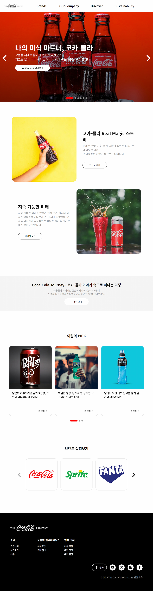
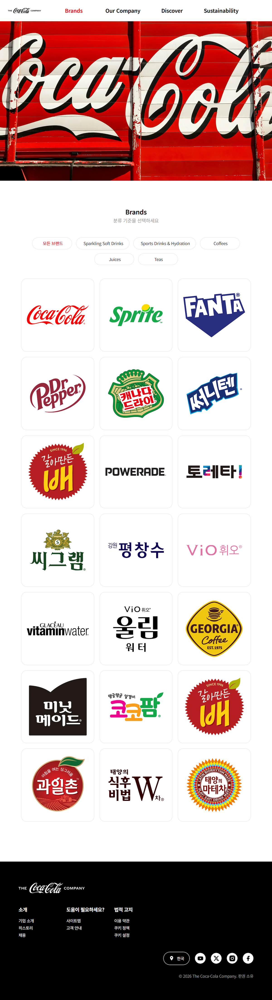
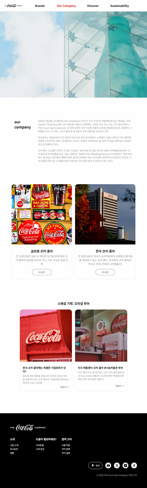
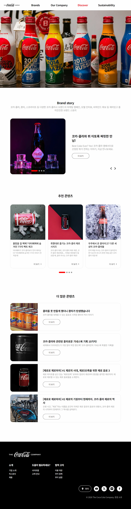
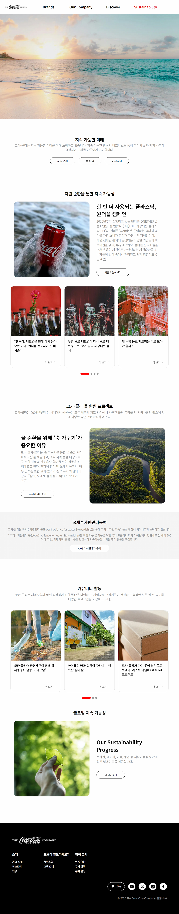
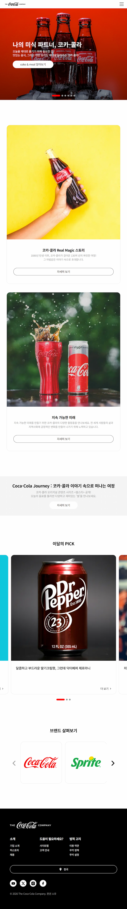
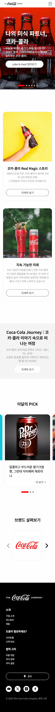

# 프로젝트 이름
코카콜라 브랜드 사이트를 리디자인한 반응형 웹 사이트 프로젝트입니다.

## 기획 의도 
주제를 선정하기에 앞서 다양한 웹사이트를 리서치 하던 중 복잡한 기능성 사이트보다는
이미지와 정보를 시각적으로 명확하게 보여줄 수 있는 브랜드 사이트 리뉴얼로 코카콜라 사이트를 채택했습니다. 
기존 사이트가 가진 레이아웃의 강점은 유지하면서, 다소 아쉬웠던 UI/UX 요소를 개선하는 데 집중했습니다.
이를 통해 사용자의 정보 접근성과 시각적 가시성을 극대화하는 것을 목표로 리디자인을 진행했습니다.

## 주요 기능
- swiper를 활용한 메인/서브 컨텐츠 슬라이드
- 사이트 스크롤을 따라오는 sticky 헤더
- 페이지 맨 상단으로 이동하는 top 버튼
- 네임앵커를 통한 컨텐츠 간 영역 이동
- 사이드 네비게이션으로 메인/서브 페이지 이동
- 탭 메뉴로 전체/개별 카테고리 브랜드 상품 표시

## 디자인 컨셉
- 깔끔하고 정돈된 느낌의 UI 리디자인
- 기존 회색 배경을 흰 색 처리하여 브랜드 색의 헤더와 푸터 간의 시각적 대비 향상
- 폰트 크기와 자간, 레이아웃 재배치 및 이미지 교체로 사이트 이미지를 새롭게 시각화 

## 사용 기술
- HTML5
- JavaScript(Vanilla)
- CSS3 (SCSS): 반복되는 스타일 및 유지 보수 편의성을 위해 사용
- Swiper.js: breakpoint별 슬라이드 개수/간격을 유연하게 대응하기 위해 사용

## 미리 보기(스크린샷)
### [PC, 1024px] - 총 5페이지 (메인 / Brand / Our Company / Discover / Sustainbility) <br>
<table>
  <tr>
    <td valign="top"></td>
    <td valign="top"></td>
      <td valign="top"></td>
  </tr>
  <tr>
    <td valign="top"></td>
    <td valign="top"></td>
  </tr>
</table>

### [반응형 예시] - 메인 페이지 <br>
### (PC: 1024px, 타블렛: 768px, 모바일: 360px)
<table>
  <tr>
    <td valign="top"></td>
    <td valign="top"></td>
    <td valign="top"></td>
  </tr>
</table>

## 개발 기간
- 2026년 1월 ~ 2026년 2월

## 어려웠던 점 & 해결 과정
- **swiper의 centeredSlides 버그** <br>
문제: 화면 최대화 시 첫 슬라이드가 잘리는 문제 <br>
해결: 작은 화면의 centeredSlides: true 설정이 큰 화면까지 상속되어 여백 과다 계산이 원인임을 파악, breakpoint별로 centeredSlides: false와 slidesPerView를 재정의하여 해결
<br><br>

- **헤더의 sticky 미작동** <br>
문제: overflow-x:hidden 영역 안에서 sticky가 동작하지 않는 문제 <br>
해결: overflow가 실제 스크롤 기준을 자체(자신) 영역으로 좁혀버리는 것이 원인임을 파악, hidden을 clip으로 변경해 스크롤 생성을 막아 해결 
<br><br>

- **헤더 메뉴 반복 열림/닫힘** <br>
문제: nav 메뉴 이동 시 열림/닫힘이 불안정하게 반복되는 문제 <br>
해결: 각 열림/닫힘 조건을 개별 li가 아닌 헤더 전체 기준으로 통일하여 해결

## 파일 구조

```
RENEW/
├── css/
├── images/
│   ├── common/
│   ├── docs/
│   ├── main/
│   └── sub/
│       ├── all-brand/
│       ├── company/
│       ├── discover/
│       └── sustainability/
├── js/
├── scss/
├── all-brand.html
├── company.html
├── discover.html
├── index.html
└── sustainability.html
```

## 참고 자료

## 실행 방법
```
$ git clone https://github.com/yona0625/project-renew.git
```
이후 `index.html` 파일을 브라우저로 열어서 확인 가능합니다.


